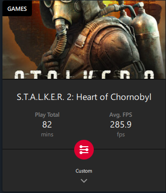
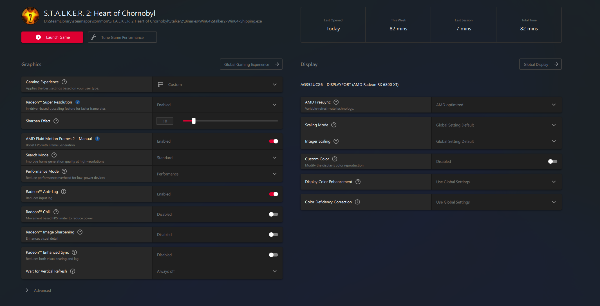

# Stalker 2 Settings

## Some Test App for managing Engine.ini settings 

## Project Structure

This project contains implementations in multiple languages:

- `rust/` - Rust implementation of the settings manager
- `dotnet/` - .NET implementation of the settings manager
- Root directory - Configuration files and documentation

### Rust Implementation

To build and run the Rust implementation:

```bash
cd rust
cargo build
cargo run
```

The Rust implementation reads and writes configuration files from the root directory.

### .NET Implementation

To build and run the .NET implementation:

```bash
cd dotnet/Stalker2Settings
dotnet build
dotnet run
```

The .NET implementation uses Terminal.Gui v2 for the terminal interface and reads/writes the same configuration files as the Rust implementation.

## Configuration tested

Processor: AMD Ryzen 9 7950 X3D 4.20 Ghz

Video: AMD Radeon RX 6800 XT

Memory: 96 Gb (DDR 5, 6000 MT/s overclocked)

Motheboard: MPG X670E Carbon Wifi with latest firmware (7D70v1M3(Beta version))

## How to apply on PC

Just copy **Engine.ini** and **GameUserSettings.ini** to folder **C:\Users\%USERNAME%\AppData\Local\Stalker2\Saved\Config\Windows** and replace file **GameUserSettings.ini**. Change your settings in game if you need to change them!

P.S. Don't forget to set **r.PSOWarmup.WarmupMaterials=1** in **Engine.ini** after update of game and rebuild shaders, after rebuild of shaders just set **r.PSOWarmup.WarmupMaterials=0**.

## FPS

Minimal 90 FPS in mostly scenes (almost 290 FPS in many locations). Very playable!

## Proof



## AMD Catalyst Settings



P.S. Let wait for improvements from devs
